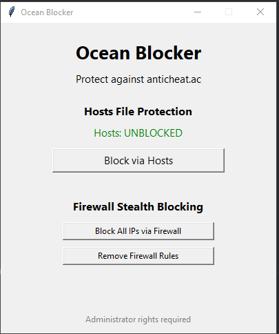

# 🛡️ Ocean Blocker

Ocean Blocker is a simple and powerful tool designed to protect users from the `anticheat.ac` domain by blocking its access through:
- The **hosts file** (DNS redirect to 127.0.0.1)
- The **Windows Firewall** (stealthy IP-level block for all apps)

> Built with ❤️ in Python and Tkinter.  
> Requires Administrator rights to function.

---

## 🖼️ Preview



---

## 🚀 Features

- 🧱 Block/Unblock `anticheat.ac` using the hosts file
- 🕵️‍♂️ Stealth Firewall blocking (no visible DNS edits)
- 🧠 Automatically resolves all known IPs of the domain
- 🔒 GUI auto-requests admin elevation
- ❌ Works even if browser cache/DNS tries to bypass hosts

---

## 🧪 How to Build It Yourself (Optional)

> You only need this if you want to build the `.exe` yourself  
> Otherwise, just download it from [Releases](#releases)

### ✅ Requirements:
- Python 3.10+  
- `pyinstaller` module installed

### 💻 Steps:

```bash
# Install PyInstaller if you don't have it
pip install pyinstaller

# Build the EXE (from the folder with roblox.py and roblox.ico)
python -m PyInstaller --onefile --noconsole --icon=roblox.ico --name roblox roblox.py
